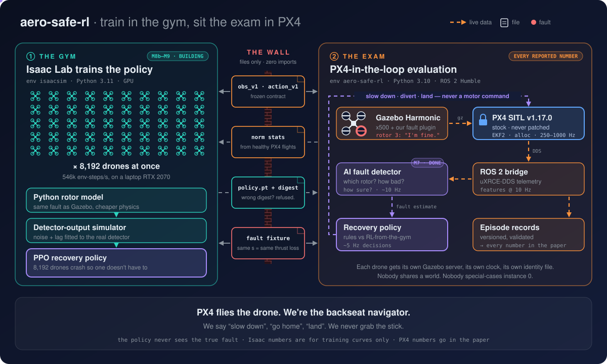
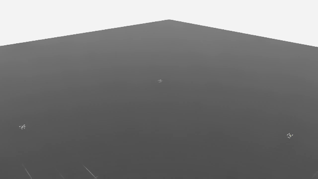

<div align="center">

# 🚁 aero-safe-rl

### Your drone has a weak motor. PX4 hasn't noticed. We have.

**AI fault detection + high-level reinforcement-learning recovery for autonomous UAVs**

*Spot a weakening motor before the flight controller does, then decide how to finish the mission safely, without ever touching the low-level controller.*

[](#-mission-progress)
[-blue)](https://github.com/PX4/PX4-Autopilot)
[](https://gazebosim.org/)
[](https://isaac-sim.github.io/IsaacLab/)
[](https://docs.ros.org/en/humble/)
[](https://pytorch.org/)
[](#license)

[The problem](#-the-problem-in-four-lines) · [Architecture](#-architecture) · [Progress](#-mission-progress) · [Bug bestiary](#-the-bug-bestiary) · [Getting started](#-getting-started) · [Roadmap](#-roadmap)

<br>

<p align="center">
  
</p>

<sub>Train in the gym (Isaac Lab), sit the exam in PX4. How to read it: <a href="#-architecture">Architecture</a>.</sub>

<br><br>


<sub>A healthy drone flying the M3 <code>square_circuit</code> mission (<a href="configs/missions/square_circuit.yaml">config</a>) through <code>EpisodeRunner</code>, the same code path every reported number comes from. Not a staged demo. Shown at 2× speed.</sub>

<br><br>



<sub>The same mission in the Isaac Lab training environment: PX4's x500 model and a PyTorch port of PX4's flight controller. Four drones, each with one rotor weakened by 0%, 30%, 45% and 70%. The two weaker ones come down, as they do in Gazebo. Training runs up to 32,768 of these in parallel on one graphics card (<a href="docs/isaac_env.md">details</a>). Shown at 4× speed.</sub>

</div>

---

## 🎭 The problem, in four lines

```text
Motor 3 ........ *quietly loses 30% of its thrust*
PX4 ............ "All systems nominal."
The drone ...... *wobbles on, a little lower, a little worse*
aero-safe-rl ... "Motor 3. Roughly 30%. Fairly sure. Let's land before this gets interesting."
```

This is not a made-up scenario. PX4's built-in `FailureDetector` is tuned for motors
that **die**, not motors that **sulk**. In this project's 750-flight fault
dataset, it stayed silent in **178 of 178** flights with a mild fault (severity
0.2–0.4) ([`docs/fault_dataset.md`](docs/fault_dataset.md)). The drone
compensates and keeps flying, just worse than it should, and nobody is told.

**aero-safe-rl** is a research platform built to close that gap:

- 🔍 **An AI detector** reads telemetry and reports, ten times a second, *which
  rotor*, *how bad*, and *how sure it is*.
- 🧭 **A high-level RL policy** takes that estimate and decides what to do:
  slow down, divert, or land.
- 🔒 **PX4's low-level control loop is never touched.** It stays stock and
  unpatched in every experiment.

Everything is built for one property: **every result must be regenerable.**
Tool versions, seeds and configs are pinned, and nothing is hand-edited after
the fact.

<details>
<summary><b>"So you taught RL to do motor mixing better than PX4?" No, and here's why that matters.</b></summary>

<br>

PX4 already has a `FailureDetector` and control-allocation-based actuator
failure handling. A paper claiming "RL beats PX4 at motor mixing" would be weak
and easy to dismiss. The contribution sits at a **different layer**:

1. **Sub-threshold, partial degradation.** PX4 handles binary motor loss
   reasonably well. It does not reason about a rotor running at 60%
   effectiveness, and that is where a learned detector earns its place.
2. **Mission-level recovery decisions.** PX4 does *not* decide whether to
   continue, slow down, re-plan, loiter or land *given an uncertain fault
   estimate*. That is a sequential decision problem under partial
   observability, which makes it a legitimate RL problem.
3. **The detection–recovery coupling.** How detector latency and errors
   propagate into closed-loop recovery outcomes. It is understudied, and it is
   the most publishable angle.

The low-level controller stays fixed and stock across every condition, so the
comparison isolates the actual contribution. Full reasoning is in
[`planning.md`](planning.md).

</details>

## ❓ Research questions

| | Question |
|---|---|
| 🔍 **RQ1: Detection** | How accurately and how quickly can a learned detector identify partial actuator degradation from telemetry alone, at severities below PX4's own failure-detector threshold? |
| 🧭 **RQ2: Recovery** | Given a fault estimate, does a learned high-level policy beat a hand-tuned rule-based policy on mission success and safety? |
| 🔗 **RQ3: Coupling** | How sensitive is recovery to detection latency and false positives? Is the combination more than the sum of its parts? |
| 🌬️ **RQ4: Generalization** | Does the policy transfer to unseen fault severities, timings, wind and vehicle parameters? |
| 🌉 **RQ5: Sim-to-sim transfer** | Does a recovery policy trained in a massively parallel GPU simulator (no autopilot software, no ROS, a simulated detector) survive the move to a full autopilot-in-the-loop stack, and what gets lost on the way? |

## 🏗️ Architecture

The diagram at the top of this page, in words.

**How to read it:**

- **① The gym (Isaac Lab).** The recovery policy trains here, on up to
  32,768 drones at once. Each one is PX4's own x500 model flown by a PyTorch
  port of PX4's flight controller, with the same rotor fault as Gazebo, and
  a simulated detector fitted to the real one's recorded output. It passes
  all 16 closed-loop agreement checks against PX4
  ([details](docs/isaac_env.md)). Crashes here are cheap.
- **🧱 The wall.** The two sides live in separate conda environments (Python
  3.11 and 3.10) and **never import each other**. They trade only files:
  the frozen observation/action spec, frozen normalisation stats, the fitted
  detector-simulator parameters, shared test fixtures, and the policy
  checkpoint. A checkpoint carries the
  digest of the spec it was trained on. If that digest is wrong, the checkpoint
  is refused, so a transfer result can't come from the two sides quietly
  disagreeing about what input #12 means.
- **② The exam (PX4-in-the-loop).** Real stock PX4, Gazebo physics and ROS 2
  run the evaluation. **Every number in the paper comes from here.** Isaac
  numbers only ever appear as labelled training curves.
- **The golden rule.** The policy only issues **high-level commands**: speed
  limits, altitude offsets, mission pacing, land. It never sends a motor
  command. That's why the same ROS 2 node could fly a real PX4 flight
  controller unchanged.

<details>
<summary><b>Who controls what, and how often</b></summary>

<br>

| Layer | Rate | Owner | Vibe |
|---|---|---|---|
| Motor mixing, rate & attitude control, EKF2 | 250–1000 Hz | **PX4 (untouched)** | the pilot |
| Position/velocity setpoint tracking | 50 Hz | **PX4** | still the pilot |
| Fault detection | ~10 Hz | Ours (AI) | the nervous passenger |
| High-level recovery decisions | ~5 Hz | Ours (RL) | the backseat navigator |

</details>

## 📊 By the numbers

All of these were measured on this machine, and each one links to how it was
measured.

| | |
|---|---|
| ✈️ **750 / 750** | fault-injection flights delivered. The run survived a full disk and a session dying mid-run, and lost **zero** episodes ([details](docs/fault_dataset.md)) |
| 🔍 **0.88 s** | median time for our detector to catch a mild fault (severity 0.2–0.4) on held-out flights, naming the right rotor 98.6–99.8% of the time ([details](docs/detector_results.md)) |
| 🙈 **178 / 178** | mild-fault flights (severity 0.2–0.4) where PX4's own failure detector said nothing ([details](docs/fault_dataset.md)) |
| ⚡ **24,297 decisions/s** | our full Isaac training environment at 32,768 parallel drones, on a laptop **RTX 2070** (Isaac's stated minimum is an RTX 4080), using 4.6 of 8 GB of graphics memory ([details](docs/isaac_env.md)) |
| 🤝 **16 / 16** | closed-loop checks where the Isaac drone flies like PX4's: mission time, speed, motor effort, crash severity, touchdown speed ([details](docs/isaac_env.md)) |
| 🪨 **s ≈ 0.42** | the physics cliff: above this rotor severity an x500 cannot hover, whatever any controller does ([details](docs/recovery_baseline.md)) |
| 🧠 **71 / 71** | missions at mild faults (severity 0.20–0.35) finished on PX4 by the policy trained in Isaac, against 6 / 23 for the tuned rule-based controller, which gave the rest up ([details](docs/rl_policy.md)) |
| 🎯 **6.44 ± 0.57 m** | position RMSE noise floor of a *healthy* mission ([details](docs/baseline_results.md)) |
| 🔁 **σ = 0.083 m** | reproducibility at a fixed seed after a hard reset ([details](docs/baseline_results.md)) |
| 🏃 **~8×** | real-time simulation speed before this machine runs out of CPU ([details](docs/simulation_notes.md)) |
| 🧪 **400** | episodes in the parallel farm's soak test ([details](docs/throughput.md)) |

## 🛫 Mission progress

```text
M0 ▰▰▰▰▰▰▰▰▰▰▰▰▰▱▱▱▱ M13      13 of 17 milestones done · M10 next
```

| # | Milestone | Status | What it bought us |
|---|---|---|---|
| M0 | Environment setup and pinning | ✅ | Every tool version nailed down |
| M1 | PX4 + Gazebo simulator running | ✅ | A drone that takes off when asked |
| M1b | Worker isolation, ownership, identity | ✅ | Many drones that don't trip over each other |
| M2 | ROS 2 talks to PX4 | ✅ ¹ | Flying any instance, not just #0 |
| M3 | Mission baseline + episode contract | ✅ | The noise floor. What "normal" looks like |
| M3b | **Isaac Lab feasibility spike** | ✅ | Proof the laptop GPU could take it |
| M4 | **Parallel evaluation farm** | ✅ ² | `EpisodeRunner`, `WorkerSupervisor`, `SimFarm` |
| M5 | Telemetry feature pipeline | ✅ | One feature extractor, frozen observation spec |
| M6 | Fault injection + dataset | ✅ | 750 flights, 597 of them sabotaged on purpose |
| M7 | AI fault detector | ✅ | Catches a mild fault in a median 0.88 s and names the right rotor 98.6–99.8% of the time |
| M8 | Rule-based recovery baseline | ✅ | The honest opponent. Finding: it does *not* beat flying on, because its own descent fools the detector ([details](docs/recovery_baseline.md)) |
| M8b | **Isaac Lab training environment** | ✅ | The gym: PX4's x500 and controller in PyTorch, 16/16 agreement checks, up to 32,768 drones ([details](docs/isaac_env.md)) |
| M9 | RL recovery policy (train Isaac, eval PX4) | ✅ | The backseat navigator. On PX4 it never panics (71/71 missions finished at mild faults, against 6/23 for the rule-based controller) and finishes 39% of missions right below the physics cliff, where the baselines finish none. Its Isaac score carries over to PX4. Trained longer, the best seed brought crashes at 0.45–0.50 down to 10 of 16, against 14 of 14 with no recovery; M10's larger runs will confirm it ([details](docs/rl_policy.md)) |
| M10 | Full experiments + results | ⏭️ next | 📄 First publishable result |
| M11 | Generalization tests | ⬜ | Wind, new faults, new timings |
| M12 | Hexacopter extension | ⬜ | Six rotors, same brain |
| M13 | Paper + reproducibility package | ⬜ | 🎓 |

<sub>¹ One open item: a DDS transport reliability gap under concurrent load, not caused by this project's code (see the bestiary below).
² One sim-marked test deferred. The full task-by-task log is in <a href="milestones.md"><code>milestones.md</code></a>.</sub>

## 🐛 The bug bestiary

Parallel drone simulation is where bugs go to hide. Every creature below
was caught in the wild, pinned to a board, and now has a rule in
[`CLAUDE.md`](CLAUDE.md) or a test so it can't come back.

| Creature | How it shows up | What was really going on |
|---|---|---|
| 🦉 **The Polite Ignorer** | Arm, takeoff and land work on drone #0. On drone #1 the vehicle just… sits there. No error. | Commands sent with `target_system = 1`. PX4 quietly drops commands addressed to someone else. Drone *N* is system *N + 1*. |
| 🪞 **The Instance-Zero Mirage** | Every single-drone test passes. Add a second drone and nothing works. | PX4 namespaces topics for every instance *except* 0. The fix is to namespace everyone (`px4_N`), so there's exactly one code path. |
| ⏳ **The Time Traveller** | Timeouts behave differently at 4× speed than at 1×. | `px4_msgs` timestamps follow the **wall clock** (measured ratio 0.991 at 4× speed). Flight logic now reads Gazebo's own clock, which gave 3.945. |
| 🏠 **The Uninvited Roommate** | Two "independent" drones share one physics world, one clock, and one crash. | By default PX4 *joins* any Gazebo world it can find. Each worker now gets its own `GZ_PARTITION` and its own server. |
| 👻 **The Ghost Flag** | `px4-param set … --instance 2` reports success. Instance 2 is unchanged. | `--instance` only works as the *first* argument. Anywhere else it's ignored, and the command hits instance 0 instead. |
| 🎭 **The Ramp in Disguise** | The simulated detector passes every check except gentle faults, where it is suspiciously fast. | When the recovery controller landed before a slowly worsening fault finished ramping up, the fit recorded the flight as a *sudden* fault. Ramp lengths now come from the fault command, and the detector is checked once on flights nobody had looked at ([details](docs/isaac_env.md)). |
| 🕵️ **The DDS Gremlin** | Under concurrent load, some flights lose offboard control (`offboard_control_signal_lost`). | **Still at large.** Confirmed not caused by this project's timing, with partial mitigation shipped. Wanted poster: [`docs/parallelism.md` §2.6](docs/parallelism.md). |

## 🚀 Getting started

> The full, reproducible setup is in
> [`docs/environment.md`](docs/environment.md). This is the short version.

```bash
# Toolchain: PX4 v1.17.0 · Gazebo Harmonic 8 · ROS 2 Humble · conda (Python 3.10)
git clone https://github.com/dee6600/aero-safe-rl.git
cd aero-safe-rl

conda env create -f environment.yml
conda activate aero-safe-rl

# Print the full pinned toolchain state as JSON
./scripts/env_report.sh

# Start (and stop) a headless PX4 + Gazebo instance
./scripts/sim_start.sh -i 0
./scripts/sim_stop.sh

# ...or watch it fly: opens the Gazebo GUI, arms, takes off, hovers,
# lands, and prints a pass/fail summary
./scripts/watch_worlds.sh -n 1

# The fast unit-test suite (no simulator needed, a few seconds)
python -m pytest tests/ -m "not sim and not slow"

# The Isaac side lives in its own environment (Isaac Sim 5.1 + Isaac Lab)
source scripts/activate_isaac.sh
python -m pytest isaac/tests -m "not isaac and not slow"
```

> [!TIP]
> Seeing `No module named rclpy` or `No module named torch`? Your install is
> probably fine. The shell just forgot its environment. Activate it again (or
> run `source scripts/activate.sh`) and try once more.

## 🧰 Tech stack

| Layer | Choice |
|---|---|
| Flight stack | [PX4 Autopilot](https://px4.io/) `v1.17.0`, stock, never patched |
| Evaluation simulator | [Gazebo Harmonic](https://gazebosim.org/) 8, plus our own gz-sim rotor-fault plugin |
| Training simulator | [NVIDIA Isaac Sim 5.1 + Isaac Lab](https://isaac-sim.github.io/IsaacLab/), GPU-parallel |
| Middleware | ROS 2 Humble, `px4_msgs` / `px4_ros_com` over uXRCE-DDS |
| ML | PyTorch: a rotor-symmetric GRU ensemble for fault detection; PPO for the recovery policy (trained on the Isaac side). scikit-learn for the detector baselines |
| Environments | two conda envs, pinned: `aero-safe-rl` (Python 3.10, evaluation) and `isaacsim` (Python 3.11, training) |

## 🗂️ Repository structure

<details>
<summary>Expand tree</summary>

```
aero-safe-rl/
├── planning.md      # research plan: questions, architecture, decisions
├── milestones.md    # the build order: what to do, in what sequence
├── CLAUDE.md        # coding rules every contributor and agent follows
├── configs/         # all experiment configuration (YAML)
├── simulation/      # PX4/Gazebo layer: models, fault injection, sim clock
├── ros2_ws/src/     # colcon workspace: telemetry pipeline, mission executor
├── ai/              # fault detection: features, detector
├── rl/              # recovery policies (rule-based, learned) and the PX4-side driver
├── isaac/           # Isaac Lab training environment (separate conda env, files only)
├── experiments/     # episode runner, parallel farm, analysis
├── scripts/         # env_report.sh, sim_start.sh, sim_stop.sh, ...
├── tests/           # unit (default), sim/ (@sim), slow/ (@slow), fixtures/
├── results/         # raw logs, trained artifacts (git-ignored)
└── docs/            # measured numbers and hard-won findings
```

</details>

## 🗺️ Roadmap

The project is built in ordered milestones. Each one has a runnable acceptance
test and its own unit tests, and no milestone starts until the previous one's
checks pass.

- **[`planning.md`](planning.md)**: the *what* and *why*. Research questions,
  architecture, RL design, evaluation method, and every major decision with
  its reasoning.
- **[`milestones.md`](milestones.md)**: the *how* and *in what order*.
  Concrete tasks, required tests, done-when checklists.
- **[`CLAUDE.md`](CLAUDE.md)**: the coding rules. Instance identity, timing,
  parallelism, testing tiers, and the anti-patterns that have already cost
  time here.
- **[`docs/parallelism.md`](docs/parallelism.md)**: verified multi-instance
  PX4/Gazebo behaviour, with source references and measured output.

🎯 **First result worth showing anyone** landed with **M7**: a detector that
spots a weakening motor PX4 never notices ([results](docs/detector_results.md)).
The rule-based recovery baseline (M8) showed why this is hard: a recovery
manoeuvre can itself mislead the detector. The learned policy (M9) trained in
Isaac Lab against a detector simulator that reproduces exactly that. On PX4 it
never gives up a mission it could finish, and it finishes some right below
the physics cliff that the baselines only land ([results](docs/rl_policy.md)).
📄 **First publishable result** lands at the end of **M10**.

<details>
<summary><b>Locked decisions</b></summary>

<br>

| ID | Decision |
|---|---|
| D1 | PX4 pinned to **`v1.17.0`** |
| D2 | Partial rotor faults via **our own gz-sim plugin**, not PX4's binary-only failure command |
| D3 | Repo named **`aero-safe-rl`** |
| D4 | Evaluation includes an oracle-detector upper bound and a detector-ablation condition |
| ~~D5~~ | ~~Simplified pre-training model **deferred**~~, **superseded by D12** |
| ~~D6~~ | ~~Isaac Sim considered and **declined**~~, **superseded by D12** |
| D7 | **One drone per world**, `GZ_PARTITION`-isolated. Silent, unchosen sharing stays prohibited |
| D8 | **We own the Gazebo server process**, so a single worker can be restarted without touching its siblings |
| D9 | **Uniform instance identity**, no special case for instance 0. Derived once and published as a file |
| D10 | **Sim time is the only clock** in flight logic, from `GzSimClock` (Gazebo's own clock), not `px4_msgs` timestamps, which track wall clock regardless of speed factor. Wall clock is used only in the hang watchdog |
| D11 | **Reproducibility is statistical, not bitwise.** Pure functions are exact; whole-pipeline results reproduce within a measured band |
| **D12** | **Train in Isaac Lab, evaluate in PX4-in-the-loop** (2026-09-21), superseding D5 and D6. GPU-parallel training removes the sample-budget risk; every *reported* number still comes from the real autopilot stack. Adds RQ5. |

Full reasoning for each: [`planning.md` §14](planning.md#14-decisions--all-approved-2026-08-14).

</details>

## License

Not decided yet. A license will be added before any external contributions or
reuse are expected.

## Acknowledgments

Built on [PX4 Autopilot](https://github.com/PX4/PX4-Autopilot),
[Gazebo](https://gazebosim.org/), [ROS 2](https://www.ros.org/) and
[NVIDIA Isaac Lab](https://isaac-sim.github.io/IsaacLab/).

Special thanks to the 597 simulated rotors that were sabotaged in the name of
science. None of them complained, and PX4 didn't notice most of them either.
