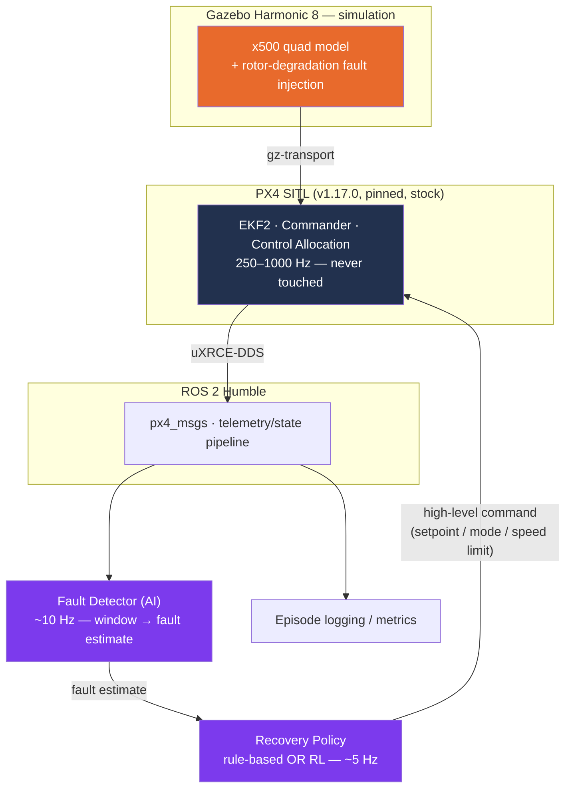

<div align="center">

# aero-safe-rl

**AI fault detection + high-level reinforcement learning recovery for autonomous UAVs**

*Detect a weakening motor before the flight controller notices. Decide how to finish the mission safely — without ever touching the low-level controller.*

[](#-project-status)
[](https://github.com/PX4/PX4-Autopilot)
[](https://gazebosim.org/)
[](https://docs.ros.org/en/humble/)
[](https://www.python.org/)
[](https://pytorch.org/)
[](#license)

[Overview](#overview) · [Research questions](#research-questions) · [Architecture](#architecture) · [Project status](#-project-status) · [Getting started](#getting-started) · [Roadmap](#roadmap)

</div>

---

## Overview

A quadcopter loses 40% of one rotor's thrust mid-flight. PX4's own failure
detector — tuned for *complete* motor loss — stays silent. The aircraft
compensates and keeps flying, worse than it should, with nobody told.

**aero-safe-rl** is a research platform built to catch exactly that: a
telemetry-based AI detector that spots sub-threshold actuator degradation
PX4 can't see, paired with a high-level reinforcement-learning policy that
decides how to finish the mission safely — slow down, divert, land — while
PX4's low-level control loop stays completely untouched and stock.

Everything here is built for one property: **every result must be
regenerable.** Tool versions, seeds, and configs are pinned; nothing is
hand-edited after the fact.

<details>
<summary><b>Why this is a real contribution, not "RL beats PX4 at motor mixing"</b></summary>

<br>

PX4 already contains a `FailureDetector` and control-allocation-based
actuator failure handling — a paper claiming "RL beats PX4 at motor mixing"
would be weak and easy to dismiss. The contribution here sits at a
**different layer**:

1. **Sub-threshold, partial degradation.** PX4 handles binary motor loss
   reasonably; it does not reason about a rotor running at 60% effectiveness.
   That's where a learned detector earns its place.
2. **Mission-level recovery decisions.** What PX4 does *not* do: decide
   whether to continue, slow down, re-plan, loiter, or land, *given an
   uncertain fault estimate*. That's a sequential decision problem under
   partial observability — a legitimate RL problem.
3. **The detection–recovery coupling.** How detector latency and error
   propagate into closed-loop recovery outcomes. Understudied, and the most
   publishable angle.

The low-level controller (PX4) stays fixed and stock across every condition,
so the comparison isolates the actual contribution. Full reasoning in
[`planning.md`](planning.md).

</details>

## Research questions

| | Question |
|---|---|
| **RQ1** — Detection | How accurately and how quickly can a learned detector identify partial actuator degradation from telemetry alone, at severities below PX4's own failure-detector threshold? |
| **RQ2** — Recovery | Given a fault estimate, does a learned high-level policy outperform a hand-tuned rule-based policy on mission success and safety? |
| **RQ3** — Coupling | How sensitive is recovery performance to detection latency and false positives — is the combination more than the sum of its parts? |
| **RQ4** — Generalization | Does the policy transfer to unseen fault severities, timings, wind, and vehicle parameters? |

## Architecture



The RL policy's action is always a **high-level command** — speed limits,
altitude offset, mission pacing, a decision to land — **never a motor
command**. That's what keeps the design hardware-transferable: the same ROS 2
node could talk to a real PX4 flight controller unchanged.

<details>
<summary><b>Control hierarchy</b></summary>

<br>

| Layer | Rate | Owner |
|---|---|---|
| Motor mixing, rate & attitude control, EKF2 | 250–1000 Hz | **PX4 (untouched)** |
| Position/velocity setpoint tracking | 50 Hz | **PX4** |
| Fault detection | ~10 Hz | Ours (AI) |
| High-level recovery decisions | ~5 Hz | Ours (RL) |

</details>

## 🚧 Project status

**Currently on M2** (ROS 2 ↔ PX4 integration). M0 and M1 are complete and
verified — see [`milestones.md`](milestones.md) for the full task-by-task
build log and [`docs/`](docs/) for measured numbers.

| # | Milestone | Status |
|---|---|---|
| M0 | Environment setup and pinning | ✅ Done |
| M1 | PX4 + Gazebo simulator running | ✅ Done |
| M2 | ROS 2 talks to PX4 | ⬜ Not started |
| M3 | Autonomous mission baseline | ⬜ Not started |
| M4 | Telemetry feature pipeline | ⬜ Not started |
| M5 | Fault injection + dataset | ⬜ Not started |
| M6 | AI fault detector | ⬜ Not started |
| M7 | Rule-based recovery baseline | ⬜ Not started |
| M8 | RL recovery policy | ⬜ Not started |
| M9 | Full experiments + results | ⬜ Not started |
| M10 | Generalization tests | ⬜ Not started |
| M11 | Hexacopter extension | ⬜ Not started |
| M12 | Paper + reproducibility package | ⬜ Not started |

<details>
<summary><b>What's actually been verified so far</b></summary>

<br>

- **Toolchain pinned and reproducible** — PX4 `v1.17.0`, Gazebo Harmonic
  `8.15.0`, ROS 2 Humble, PyTorch `2.13+cu126` with CUDA verified on the
  target GPU. Full record: [`docs/environment.md`](docs/environment.md).
- **Headless SITL scripted** (`scripts/sim_start.sh` / `sim_stop.sh`) —
  arms, takes off, hovers, lands from a single command, with clean shutdown
  and no orphaned processes.
- **Real-time factor measured, not assumed** — this machine is compute-bound
  at **~8× real-time**; flight stayed stable and clean at every tested speed
  factor up to a 16× request. Full breakdown:
  [`docs/simulation_notes.md`](docs/simulation_notes.md).
- **Multi-instance simulation confirmed conflict-free** — two concurrent PX4
  instances share one Gazebo world with independent ports and spawn
  positions, ready for M8's parallel training.

</details>

## Getting started

> The full, reproducible environment setup lives in
> [`docs/environment.md`](docs/environment.md) — this is the short version.

```bash
# Toolchain: PX4 v1.17.0 · Gazebo Harmonic 8 · ROS 2 Humble · conda (Python 3.10)
git clone https://github.com/dee6600/aero-safe-rl.git
cd aero-safe-rl

conda env create -f environment.yml
conda activate aero-safe-rl

# Print the full pinned toolchain state as JSON
./scripts/env_report.sh

# Start a headless PX4 + Gazebo instance
./scripts/sim_start.sh -i 0
./scripts/sim_stop.sh

# ...or watch it fly: opens the Gazebo GUI, arms, takes off, hovers, lands,
# and prints a pass/fail checklist
./scripts/sim_watch.sh
```

## Tech stack

| Layer | Choice |
|---|---|
| Flight stack | [PX4 Autopilot](https://px4.io/) `v1.17.0`, stock, never patched |
| Simulator | [Gazebo Harmonic](https://gazebosim.org/) 8 (+ an optional [Isaac Sim](docs/isaac_sim.md) learning track) |
| Middleware | ROS 2 Humble, `px4_msgs` / `px4_ros_com` over uXRCE-DDS |
| ML | PyTorch, Gymnasium, Stable-Baselines3 (PPO) |
| Environment | conda (`aero-safe-rl` env), pinned via `environment.yml` |

## Repository structure

<details>
<summary>Expand tree</summary>

```
aero-safe-rl/
├── planning.md      # research plan: questions, architecture, decisions
├── milestones.md    # the build order — what to do, in what sequence
├── configs/         # all experiment configuration (YAML)
├── simulation/      # PX4/Gazebo layer — models, fault injection
├── ros2_ws/src/     # colcon workspace — telemetry pipeline, mission executor
├── ai/              # fault detection — features, models, training
├── rl/              # reinforcement learning — env, rewards, policies
├── experiments/     # batch orchestration + analysis
├── scripts/         # env_report.sh, sim_start.sh, sim_stop.sh, ...
├── tests/           # unit + integration tests
├── results/         # raw logs, trained artifacts (git-ignored)
└── docs/            # environment.md, simulation_notes.md, design notes
```

</details>

## Roadmap

This project is built in 12 ordered milestones, each with an explicit,
runnable acceptance test — no milestone starts until the previous one's
checks all pass.

- **[`planning.md`](planning.md)** — the *what* and *why*: research
  questions, architecture, RL design, evaluation methodology, and every
  major decision with its reasoning.
- **[`milestones.md`](milestones.md)** — the *how* and *in what order*:
  concrete tasks, files created, and done-when checklists per milestone.

**First result worth showing anyone** lands at the end of **M6** — a
detector that spots a weakening motor PX4 itself never notices.
**First publishable result** lands at the end of **M9**.

<details>
<summary><b>Locked decisions</b></summary>

<br>

| ID | Decision |
|---|---|
| D1 | PX4 pinned to **`v1.17.0`** |
| D2 | Partial rotor faults via **our own gz-sim plugin**, not PX4's binary-only failure command |
| D3 | Repo named **`aero-safe-rl`** |
| D4 | Evaluation includes an oracle-detector upper bound and a detector-ablation condition |
| D5 | Simplified pre-training model **deferred** unless full-stack training proves infeasible |
| D6 | **Gazebo stays primary** for all research milestones; Isaac Sim is an optional, non-blocking learning track |

Full reasoning for each: [`planning.md` §14](planning.md#14-decisions--all-approved-2026-08-14).

</details>

## License

Not yet decided — a license will be added before any external contributions
or reuse are expected.

## Acknowledgments

Built on [PX4 Autopilot](https://github.com/PX4/PX4-Autopilot),
[Gazebo](https://gazebosim.org/), and [ROS 2](https://www.ros.org/).
